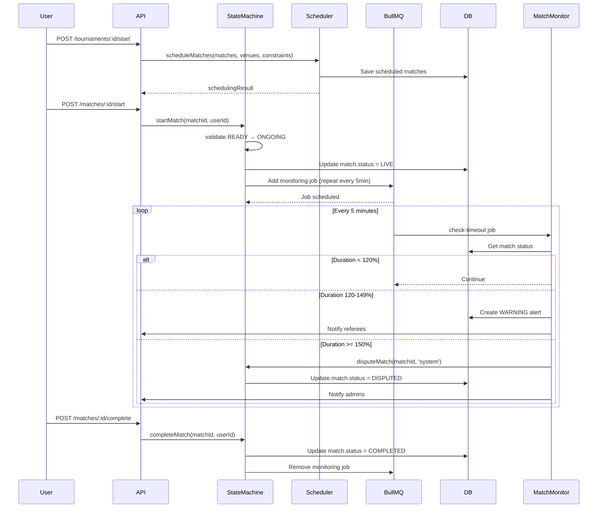

# 🧠 Business Logic - Logique Métier Complexe

## 📋 Table des Matières
1. [Vue d'ensemble](#vue-densemble)
2. [Smart Planning - Algorithme de Scheduling](#smart-planning)
3. [State Machine des Matchs](#state-machine-des-matchs)
4. [Arbitre Virtuel - Monitoring BullMQ](#arbitre-virtuel)
5. [Intégration Complète](#intégration-complète)

---

## 🎯 Vue d'ensemble

Ce document détaille la logique métier complexe implémentée pour la plateforme de tournois :

- **Smart Planning** : Algorithme de génération de calendrier avec contraintes
- **State Machine** : Gestion des états des matchs avec transitions validées
- **Arbitre Virtuel** : Système de monitoring automatique des matchs via BullMQ

---

## 📅 Smart Planning - Algorithme de Scheduling

### Problématique

Générer un calendrier optimal pour tous les matchs d'un tournoi en respectant :

**Contraintes Dures :**
- ✅ Disponibilité des terrains (1 terrain = 1 match à la fois)
- ✅ Temps de repos minimum entre matchs pour chaque participant
- ✅ Durée estimée de chaque match (BO1, BO3, BO5)
- ✅ Fenêtre temporelle du tournoi (startTime → endTime)

**Contraintes Souples :**
- 🎯 Minimiser les temps morts (optimiser l'utilisation des terrains)
- 🎯 Équité horaire (ne pas surcharger certains participants)
- 🎯 Préférences de terrain si spécifiées

### Solution : Algorithme Greedy + Backtracking

#### Complexité
- **Greedy seul** : O(n²) en pratique (n = nombre de matchs)
- **Avec Backtracking** : O(n⁵) max (limité par depth=5)

#### Étapes de l'Algorithme

```typescript
// 1. TRI DES MATCHS PAR PRIORITÉ
sortedMatches = SortMatchesByPriority(matches)
// Critères: phase (finals > semis), round (DESC), priorité

// 2. POUR CHAQUE MATCH
for (match of sortedMatches) {
  // 3. CALCULER HEURE DÉBUT MINIMALE
  minStartTime = MAX(
    tournamentStart,
    lastMatchEnd[participant] + minRestTime
  )

  // 4. TROUVER MEILLEUR CRÉNEAU
  bestSlot = FindBestTimeSlot(match, venues, minStartTime)

  if (!bestSlot) {
    // 5. BACKTRACKING SI ÉCHEC
    TryReorganizePreviousMatches()
  }

  // 6. ASSIGNER LE CRÉNEAU
  AssignSlot(match, bestSlot)
}
```

#### Scoring Heuristique

Chaque créneau candidat reçoit un score :

| Critère | Score | Explication |
|---------|-------|-------------|
| Horaire premium (10h-18h) | +100 | Évite matchs trop tôt/tard |
| Combler un trou | +200 | Optimise l'utilisation |
| Préférence terrain | +50 | Respecte les préférences |
| Charge participant faible | +0 à -30 | Équité |

**Exemple :**
```typescript
score = 100 (horaire) + 200 (comble trou) + 50 (préféré) - 10 (charge) = 340
```

### Implémentation

**Fichiers :**
- `docs/algorithms/match-scheduling.md` - Pseudo-code détaillé
- `src/modules/tournament/services/scheduler.service.ts` - Implémentation TypeScript
- `src/modules/tournament/types/scheduling.types.ts` - Types

**Usage :**
```typescript
const schedulerService = new SchedulerService();

const result = await schedulerService.scheduleMatches(
  matches,       // Liste des matchs à planifier
  venues,        // Liste des terrains disponibles
  {
    minRestTime: 60,      // 1 heure de repos minimum
    startTime: new Date('2025-01-15T09:00:00Z'),
    endTime: new Date('2025-01-15T22:00:00Z'),
  }
);

console.log(`Quality score: ${result.metrics.qualityScore}`);
console.log(`Venue utilization: ${result.metrics.venueUtilization * 100}%`);
```

**Résultat :**
```typescript
{
  scheduledMatches: [
    {
      id: "match-1",
      scheduledAt: "2025-01-15T09:00:00Z",
      venueId: "venue-A",
      endTime: "2025-01-15T11:00:00Z"
    },
    // ...
  ],
  metrics: {
    venueUtilization: 0.85,    // 85% d'utilisation
    averageRestTime: 90,       // 90 minutes de repos moyen
    qualityScore: 0.82         // Score global: 82/100
  },
  warnings: []
}
```

### Métriques de Qualité

Le service calcule automatiquement :

1. **Utilisation des terrains** : `totalDuration / capacityAvailable`
2. **Temps de repos moyen** : Moyenne entre matchs consécutifs par participant
3. **Score de qualité global** : Combinaison pondérée (0-1)

```typescript
qualityScore =
  venueUtilization × 0.3 +
  (avgRestTime / minRestTime) × 0.3 +
  peakLoadScore × 0.2 +
  (1 - violations) × 0.2
```

---

## 🔄 State Machine des Matchs

### Diagramme d'États

```
┌─────────┐
│ PENDING │ Match créé, participants non confirmés
└────┬────┘
     │ confirmParticipants()
     ▼
┌─────────┐
│  READY  │ Participants confirmés, prêt à démarrer
└────┬────┘
     │ startMatch()
     ▼
┌─────────┐     dispute()      ┌─────────┐
│ ONGOING │ ─────────────────▶ │ DISPUTE │ Litige en cours
└────┬────┘                    └────┬────┘
     │ completeMatch()              │ resolveDispute()
     ▼                              ▼
┌───────────┐                  ┌───────────┐
│ COMPLETED │                  │ COMPLETED │
└───────────┘                  └───────────┘

     │ (any state)
     ▼
┌───────────┐
│ CANCELLED │ Match annulé
└───────────┘
```

### Transitions Autorisées

| État Actuel | États Possibles |
|-------------|-----------------|
| **PENDING** | READY, CANCELLED |
| **READY** | ONGOING, CANCELLED |
| **ONGOING** | COMPLETED, DISPUTE, CANCELLED |
| **DISPUTE** | COMPLETED, CANCELLED |
| **COMPLETED** | ∅ (terminal) |
| **CANCELLED** | ∅ (terminal) |

### Validations Pré-Transition

#### PENDING → READY
```typescript
✅ Les deux participants doivent être assignés
❌ Bloque si homeParticipantId ou awayParticipantId est null
```

#### READY → ONGOING
```typescript
✅ Match ne peut démarrer plus de 30 min avant l'heure prévue
❌ Bloque si trop tôt par rapport à scheduledAt
```

#### ONGOING → COMPLETED
```typescript
✅ Un gagnant doit être défini (sauf draw autorisé)
❌ Bloque si homeScore === awayScore && winnerId === null
```

#### ANY → CANCELLED
```typescript
✅ Autorisé depuis n'importe quel état sauf COMPLETED
❌ Bloque si déjà terminé
```

### Implémentation

**Fichier :** `src/modules/tournament/state-machines/match.state-machine.ts`

**API :**
```typescript
const stateMachine = new MatchStateMachine(prisma);

// Transition générique
const result = await stateMachine.transition(
  matchId,
  MatchState.ONGOING,
  'user-123',  // triggeredBy
  'Manual start'
);

// Helpers spécifiques
await stateMachine.markAsReady(matchId, userId);
await stateMachine.startMatch(matchId, userId);
await stateMachine.completeMatch(matchId, userId);
await stateMachine.disputeMatch(matchId, userId, reason);
await stateMachine.cancelMatch(matchId, userId, reason);
```

**Résultat :**
```typescript
{
  success: true,
  newState: MatchState.ONGOING,
  message: "Match state changed to ONGOING",
  metadata: {
    subState: undefined,
    transitionHistory: [
      {
        from: MatchState.READY,
        to: MatchState.ONGOING,
        timestamp: "2025-01-15T14:30:00Z",
        triggeredBy: "user-123",
        reason: "Manual start"
      }
    ]
  }
}
```

### Métadonnées & Historique

Chaque transition est enregistrée dans `match.metadata` :

```json
{
  "subState": "ready",
  "transitionHistory": [
    {
      "from": "PENDING",
      "to": "READY",
      "timestamp": "2025-01-15T14:00:00Z",
      "triggeredBy": "user-123"
    },
    {
      "from": "READY",
      "to": "ONGOING",
      "timestamp": "2025-01-15T14:30:00Z",
      "triggeredBy": "user-123",
      "reason": "Manual start"
    }
  ]
}
```

**Récupération :**
```typescript
const history = await stateMachine.getTransitionHistory(matchId);
// Returns: Array<{from, to, timestamp, triggeredBy, reason}>
```

### Side-Effects Automatiques

La State Machine déclenche automatiquement :

| Transition | Side-Effect |
|------------|-------------|
| → ONGOING | 🚀 Lance le job de monitoring BullMQ |
| → COMPLETED | 📊 Met à jour les stats, notifie participants |
| → DISPUTE | 🚨 Notifie les arbitres |
| → CANCELLED | 💰 Déclenche les remboursements |

---

## 🤖 Arbitre Virtuel - Monitoring BullMQ

### Objectif

Détecter automatiquement les matchs qui durent anormalement longtemps et déclencher des alertes.

### Fonctionnement

#### 1. Démarrage du Monitoring

Quand un match passe à `ONGOING`, un **job BullMQ répétitif** est créé :

```typescript
import { InjectQueue } from '@nestjs/bull';
import { Queue } from 'bull';

@Injectable()
export class MatchService {
  constructor(
    @InjectQueue('match-monitor') private matchMonitorQueue: Queue,
  ) {}

  async startMatch(matchId: string) {
    // Transition vers ONGOING
    await this.stateMachine.startMatch(matchId, userId);

    // Créer le job de monitoring
    await this.matchMonitorQueue.add(
      'check-timeout',
      {
        matchId,
        startedAt: new Date(),
        expectedDuration: 120,      // 2 heures (BO3)
        warningThreshold: 1.2,      // Alerte à 120% (2h24)
        criticalThreshold: 1.5,     // Critique à 150% (3h)
      },
      {
        repeat: {
          every: 5 * 60 * 1000,     // Vérifier toutes les 5 minutes
        },
        jobId: `monitor-${matchId}`, // Évite les doublons
      },
    );
  }
}
```

#### 2. Exécution Périodique

Le job s'exécute **toutes les 5 minutes** et vérifie :

```typescript
currentDuration = now - startedAt
percentage = (currentDuration / expectedDuration) × 100

if (percentage >= 150%) {
  → CRITICAL TIMEOUT
} else if (percentage >= 120%) {
  → WARNING TIMEOUT
} else {
  → Continue monitoring
}
```

#### 3. Seuils de Timeout

| Seuil | % | Exemple (BO3 = 120min) | Action |
|-------|---|------------------------|--------|
| **Normal** | < 120% | < 2h24 | Monitoring continue |
| **Warning** | 120-149% | 2h24 - 2h59 | Alerte arbitres |
| **Critical** | ≥ 150% | ≥ 3h | Mise en DISPUTE |

### Actions Automatiques

#### WARNING (120-149%)

```typescript
⚠️  Actions:
1. Créer une notification pour les arbitres
2. Logger dans match.metadata.timeoutWarnings
3. Continuer le monitoring
```

**Exemple de notification :**
```json
{
  "type": "MATCH_TIMEOUT_WARNING",
  "severity": "warning",
  "message": "Match is taking longer than expected: 145 minutes (121% of expected)",
  "metadata": {
    "currentDuration": 145,
    "expectedDuration": 120,
    "exceedPercentage": 121
  }
}
```

#### CRITICAL (≥ 150%)

```typescript
🚨 Actions:
1. Créer une alerte CRITIQUE
2. Notifier arbitres ET admins
3. METTRE LE MATCH EN DISPUTE automatiquement
4. Arrêter le monitoring (état terminal)
```

**Transition automatique :**
```typescript
await stateMachine.disputeMatch(
  matchId,
  'system',
  `Automatic dispute due to critical timeout: 180 minutes (expected: 120)`
);
```

### Implémentation

**Fichier :** `src/modules/tournament/processors/match-monitor.processor.ts`

**Job Processor :**
```typescript
@Processor('match-monitor')
export class MatchMonitorProcessor {
  @Process('check-timeout')
  async handleMatchTimeout(job: Job<MatchMonitorJobData>) {
    const { matchId, startedAt, expectedDuration, warningThreshold, criticalThreshold } = job.data;

    // 1. Récupérer le match
    const match = await this.prisma.match.findUnique({ where: { id: matchId } });

    // 2. Vérifier si toujours ONGOING
    const currentState = await this.stateMachine.getMatchState(matchId);
    if (currentState !== MatchState.ONGOING) {
      return { action: 'stopped', reason: `Match is ${currentState}` };
    }

    // 3. Calculer la durée
    const currentDurationMinutes = (now - startedAt) / (1000 * 60);
    const exceedPercentage = (currentDurationMinutes / expectedDuration) * 100;

    // 4. Vérifier les seuils
    if (exceedPercentage >= criticalThreshold * 100) {
      return await this.handleCriticalTimeout(match, {...});
    } else if (exceedPercentage >= warningThreshold * 100) {
      return await this.handleWarningTimeout(match, {...});
    }

    return { action: 'continue', currentDuration: currentDurationMinutes };
  }
}
```

### Arrêt du Monitoring

Quand le match se termine, le job est supprimé :

```typescript
async completeMatch(matchId: string) {
  // Transition vers COMPLETED
  await this.stateMachine.completeMatch(matchId, userId);

  // Supprimer le job répétitif
  const repeatableJobs = await this.matchMonitorQueue.getRepeatableJobs();
  const job = repeatableJobs.find(j => j.id === `monitor-${matchId}`);

  if (job) {
    await this.matchMonitorQueue.removeRepeatableByKey(job.key);
  }
}
```

### Stockage des Alertes

Les alertes sont sauvegardées dans le modèle `Job` :

```typescript
await prisma.job.create({
  data: {
    type: 'MATCH_NOTIFICATION',
    status: 'COMPLETED',
    data: {
      alertType: 'MATCH_TIMEOUT_CRITICAL',
      matchId,
      severity: 'critical',
      message: 'Match timeout exceeded 150%',
      currentDuration: 180,
      expectedDuration: 120,
    },
  },
});
```

### Configuration du Module

```typescript
@Module({
  imports: [
    BullModule.registerQueue({
      name: 'match-monitor',
    }),
  ],
  providers: [
    MatchStateMachine,
    MatchMonitorProcessor,
  ],
})
export class TournamentModule {}
```

---

## 🔗 Intégration Complète

### Workflow Complet d'un Match



### Exemple d'Usage Complet

```typescript
// 1. CRÉER UN TOURNOI
const tournament = await prisma.tournament.create({
  data: {
    name: "Summer Championship 2025",
    type: "SINGLE_ELIMINATION",
    maxParticipants: 16,
    organizerId: "user-123",
    // ...
  },
});

// 2. GÉNÉRER LE CALENDRIER
const schedulerService = new SchedulerService();

const result = await schedulerService.scheduleMatches(
  tournamentMatches,
  venues,
  {
    minRestTime: 60,
    startTime: new Date('2025-01-15T09:00:00Z'),
    endTime: new Date('2025-01-15T22:00:00Z'),
  }
);

// Sauvegarder les matches planifiés
for (const match of result.scheduledMatches) {
  await prisma.match.update({
    where: { id: match.id },
    data: {
      scheduledAt: match.scheduledAt,
      venueId: match.venueId,
    },
  });
}

// 3. DÉMARRER UN MATCH (jour du tournoi)
const stateMachine = new MatchStateMachine(prisma);

// 3a. Confirmer les participants
await stateMachine.markAsReady(matchId, 'referee-456');

// 3b. Démarrer le match
await stateMachine.startMatch(matchId, 'referee-456');

// → Déclenche automatiquement le monitoring BullMQ

// 4. LE MONITORING S'EXÉCUTE AUTOMATIQUEMENT
// Toutes les 5 minutes, BullMQ vérifie la durée
// Si timeout, alerte ou mise en DISPUTE

// 5. TERMINER LE MATCH
await stateMachine.completeMatch(matchId, 'referee-456');

// → Arrête automatiquement le monitoring
```

---

## 📊 Métriques & Monitoring

### Dashboard Admin (à implémenter)

```typescript
// Statistiques des matchs
const stats = await prisma.match.groupBy({
  by: ['status'],
  _count: true,
});
// { ONGOING: 5, COMPLETED: 42, DISPUTED: 2 }

// Matchs en timeout WARNING
const warnings = await prisma.job.findMany({
  where: {
    data: {
      path: ['alertType'],
      equals: 'MATCH_TIMEOUT_WARNING',
    },
  },
});

// Qualité moyenne des calendriers
const avgQuality = await calculateAverageScheduleQuality();
// 0.82 (82/100)
```

---

## 🚀 Prochaines Étapes (Phase 3)

1. **Intégration avec Notifications**
   - WebSocket pour alertes temps réel
   - Email pour alertes critiques

2. **Dashboard Admin**
   - Visualisation calendriers
   - Monitoring en temps réel des matchs
   - Override manuel des timeouts

3. **IA Prédictive**
   - Estimation dynamique de la durée des matchs
   - Ajustement automatique des seuils de timeout

4. **Tests**
   - Unit tests pour State Machine
   - Integration tests pour Scheduler
   - E2E tests pour le workflow complet

---

## 📚 Références

- **Algorithmes** : `/docs/algorithms/match-scheduling.md`
- **Code Source** :
  - Scheduler : `/src/modules/tournament/services/scheduler.service.ts`
  - State Machine : `/src/modules/tournament/state-machines/match.state-machine.ts`
  - Monitor : `/src/modules/tournament/processors/match-monitor.processor.ts`

---

**Version :** 2.0
**Date :** 2025-11-29
**Auteurs :** Senior Backend Architect & Lead Developer
